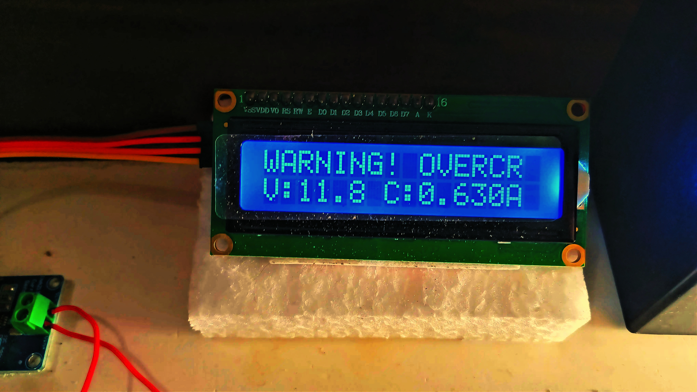

# Smart Load Management and Backup Protection System

**Department of Electrical & Electronic Engineering (EEE)**  
*Rajshahi University of Engineering & Technology (RUET), Bangladesh*  
**Authors**: Md. Al Amin Islam & Team

📄 **[View/Download Full Project Report (PDF)](<report.pdf>)**

---

## 📌 Abstract
This project presents a low-cost, microcontroller-based battery monitoring and protection system built around the Arduino Uno platform. The system continuously measures voltage and current delivered by a 12V, 7.5 Ah Sealed Lead-Acid (SLA) battery using an INA219 digital sensor. When current exceeds a preset safety threshold, the system triggers a visual and audible alarm, displays a warning on a 16x2 LCD, and opens a relay to isolate the load and protect the battery.

---

## ✨ Key Features
- **Real-Time Sensing**: High-accuracy voltage and current acquisition via INA219 sensor over I2C.
- **Automatic Overload Isolation**: Disconnects load via relay when fault conditions occur.
- **Dual Visual Indicators**: 16x2 LCD for live numerical telemetry and a 10-LED bar-graph for status level.
- **Audible Warning**: Piezoelectric buzzer alerts during overcurrent conditions.
- **Manual Override**: Physical rocker switches and push buttons for individual channel switching and mode selection.

---

## 🛠️ Hardware Components

| Component | Quantity | Role / Function |
| :--- | :---: | :--- |
| **Arduino Uno (ATmega328P)** | 1 | Main controller processing sensor logic and driving outputs |
| **INA219 Sensor** | 1 | I2C digital current and voltage monitoring module |
| **4-Channel 5V Relay Module** | 1 | Switches DC load lines and provides emergency load shedding |
| **16x2 Character LCD** | 1 | Live status display for voltage, current, and warnings |
| **LED Bar-Graph** | 10 LEDs | Visual scale for load/battery level |
| **Optocoupler (PC817)** | 1 | Grid presence detection for power source switching |
| **12V, 7.5 Ah SLA Battery** | 1 | Main DC supply under test |
| **Rocker Switches (SPST)** | 3 | Manual ON/OFF channel control switches |

---

## ⚡ System Operation & Results

### Normal Operation vs Fault Detection
- **Normal State**: The LCD outputs live parameters (e.g., `V: 11.8V | C: 0.638A`) under steady load.
- **Fault State**: If current exceeds the limit, the system displays `WARNING! OVERCURRENT`, activates the alarm, and de-energizes the relay channel to isolate the load.

| Prototype Hardware Setup | Overcurrent Alarm Triggered |
| :---: | :---: |
|  |  |

---

## 💻 Source Code & Presentation
- **Arduino Code**: Available in [`arduino_code_for_project.ino`](arduino_code_for_project.ino).
- **Poster View**: Available in [`poster_view.jpg`](poster_view.jpg).

---

## 🚀 Future Improvements
- Migration from breadboard prototyping to a dedicated PCB layout.
- Implementation of Wi-Fi / Bluetooth (ESP32/HC-05) for mobile app monitoring and control.
- Implementation of deep-discharge and over-voltage protection algorithms.
